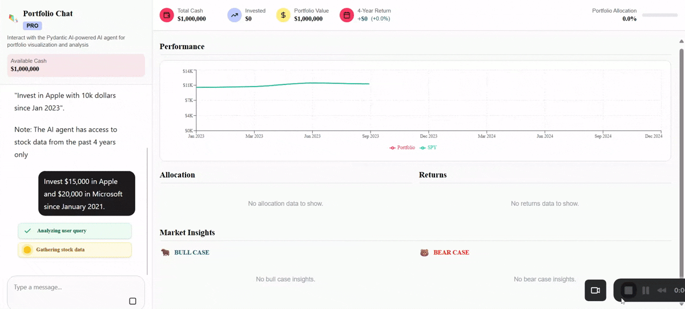

# open-ag-ui-demo


A demo project with a Next.js frontend and a FastAPI-based backend agent for stock analysis and chat.

---

## Project Structure

- `frontend/` — Next.js 15 app (UI)
- `agent/` — FastAPI backend agent (Python)

---

## Getting Started

### 1. Environment Configuration

Create a `.env` file in each relevant directory as needed. 

#### Backend (`agent/.env`):
```env
OPENAI_API_KEY=<<your-gemini-key-here>>
```

#### Frontend (`frontend/.env`):
```env
OPENAI_API_KEY=<<your-gemini-key-here>>
```

---

### 2. Start the Backend Agent

```bash
cd agent
poetry install
poetry run python main.py
```

---

### 3. Start the Frontend

```bash
cd frontend
pnpm install
pnpm run dev
```

Open [http://localhost:3000](http://localhost:3000) in your browser to view the app.

---

## Notes
- Ensure the backend agent is running before using the frontend.
- Update environment variables as needed for your deployment.

---

### Hosted URL : https://open-ag-ui-demo-pydantic   .vercel.app/